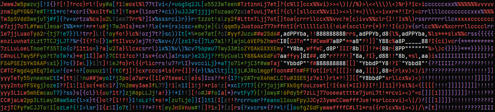

# asciiart
generates ascii text plus cool ascii background from any image, useful for stuff like LinkedIn profile background

## Setup:
`pip install -r requirements.txt`
then run `main.py`

## Example output:
